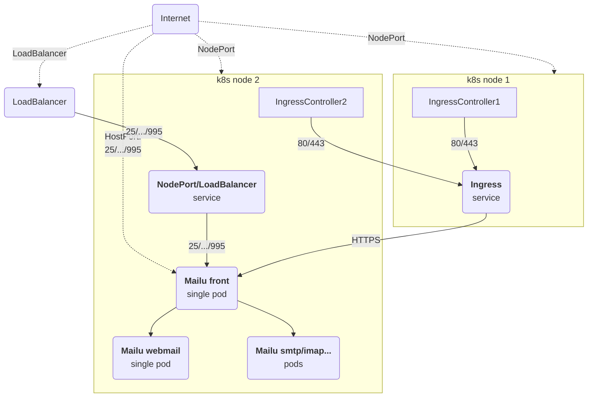

# Mailu setups with the Helm Chart

WIP: This document shall describe and show how Mailu can be setup with the Helm Chart.

> [!IMPORTANT]
> Routing all traffic, including Web traffic through the Mailu `front` service is done **on purpose** to deliver
> an integrated service to the users of Mailu. You are free to run components separately, but such setups are not in scope
> of the Mailu project or the Mailu Helm Chart and are not supported. Using `HTTPS` as backend for the ingress is also a
> conscious decision and allows for an integrated experience while keeping the scope small for the volunteer dev team.

## Simple setup

This is a simple setup to make Mailu services available from the internet.
Cert-manager is used to get a certificate for the Ingress. The same certificate is used by the `front` deployment for
mail services.

How traffic is routed from a public IP address to individual K8s nodes is out of scope and must be taken care of individually.
Typically K8s nodes have private IP addresses and a Service of type LoadBalancer is used to make services available on public IPs.

This setup is using a single instance where Mail services will be reachable either through HostPort or
a Service of type NodePort or LoadBalancer.



### Using HostPort (default)

- Enabled by default through `front.hostPort.enabled=true`
- Ingress for Webmail (80, 443)
- Host ports (25, 110, 143, 465, 587, 993, 995)
  - binding ports on the current node (host) directly to the front pod

### Using NodePort

Same as the above, but using a Service of type `NodePort` to bind ports on every node to the external service.

```yaml
# values.yaml
front:
  hostPort:
    enabled: false
  externalService:
    enabled: true
    type: NodePort
    nodePort:
      # optionally define specific ports
      imaps: 30995
```

### Using LoadBalancer

Again the same as above, but using a Service of type `LoadBalancer` to assign a public IP on which to reach the external service:

```yaml
# values.yaml
front:
  hostPort:
    enabled: false
  externalService:
    enabled: true
    type: LoadBalancer
```

## K8s nodes with public IPs

> [!WARNING]
> Traffic between pods is unencrypted, use [istio](https://istio.io/) or similar to ensure traffic between pods of the k8s nodes is encrypted.

If your cluster nodes use public IPs, you can directly access the mail ports from the internet, for example using the
default HostPort or a NodePort Service described above.
