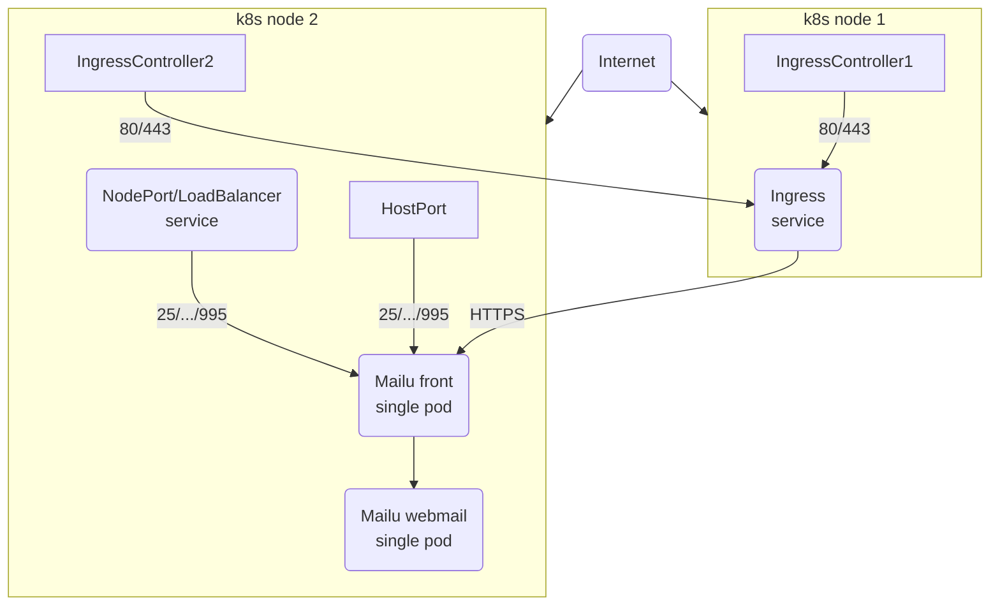

# Mailu setups with the Helm Chart

WIP: This document shall describe and show how Mailu can be setup with the Helm Chart.

## Simple setup

This is a simple setup to make Mailu services available from the internet.
Cert-manager is used to get a certificate for the Ingress. The same certificate is used by the `front` deployment for
mail services.

How traffic is routed from a public IP address to individual K8s nodes is out of scope and must be taken care of individually.
Typically K8s nodes have private IP addresses and a Service of type LoadBalancer is used to make services available on public IPs.

This setup is using a single instance where Mail services will be reachable either through HostPort or
a Service of type NodePort or LoadBalancer.



### Using HostPort (default)

- Ingress for Webmail (80, 443)
- Host port for Mail ports (25, 110, 143, 465, 587, 993, 995)

### Using NodePort

Same as the above, but using a Service of type `NodePort` to bind K8s node ports to the mail services.

```yaml
# values.yaml
front:
  hostPort:
    enabled: false
  externalService:
    enabled: true
    type: NodePort
```

### Using LoadBalancer

Again the same as above, but using a Service of type `LoadBalancer` to assign a public IP on which to reach the mail services:

```yaml
# values.yaml
front:
  hostPort:
    enabled: false
  externalService:
    enabled: true
    type: LoadBalancer
```

## K8s nodes with public IPs
!Warning section: traffic between pods is unencrypted, use istio or similar to ensure traffic between k8s nodes is encrypted.
